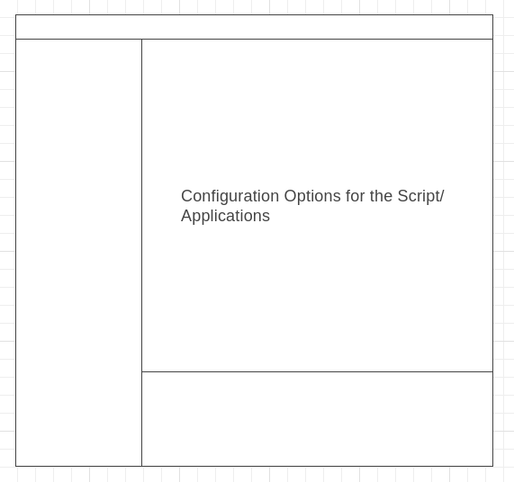
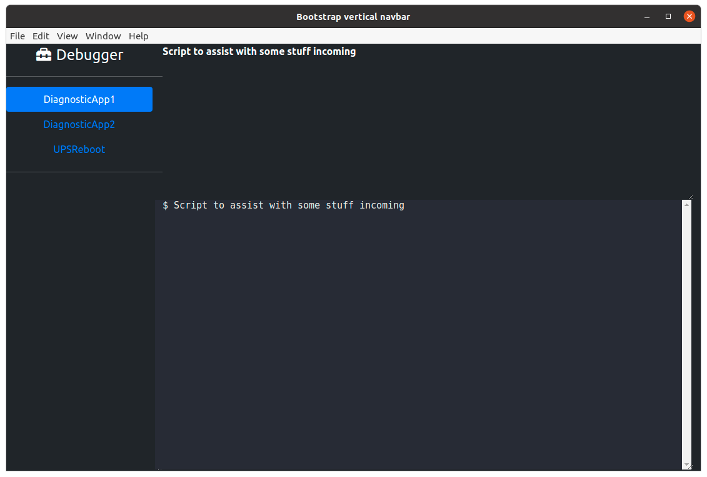
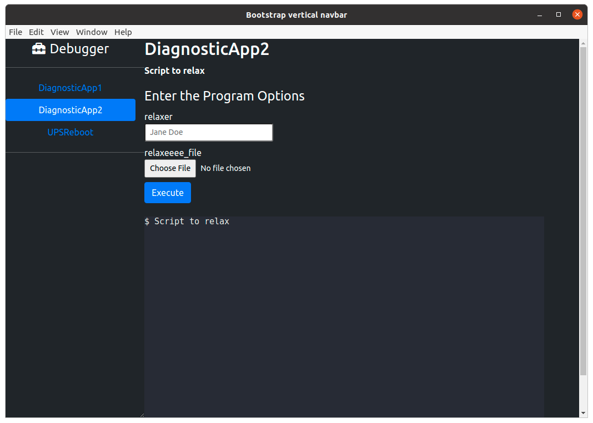
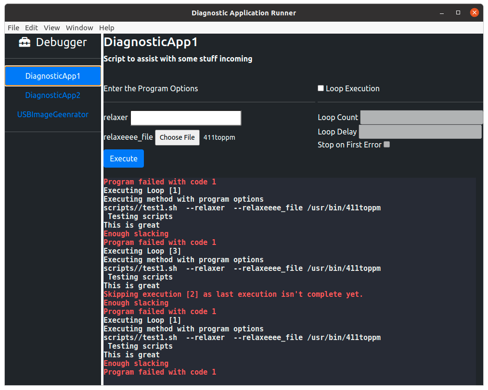
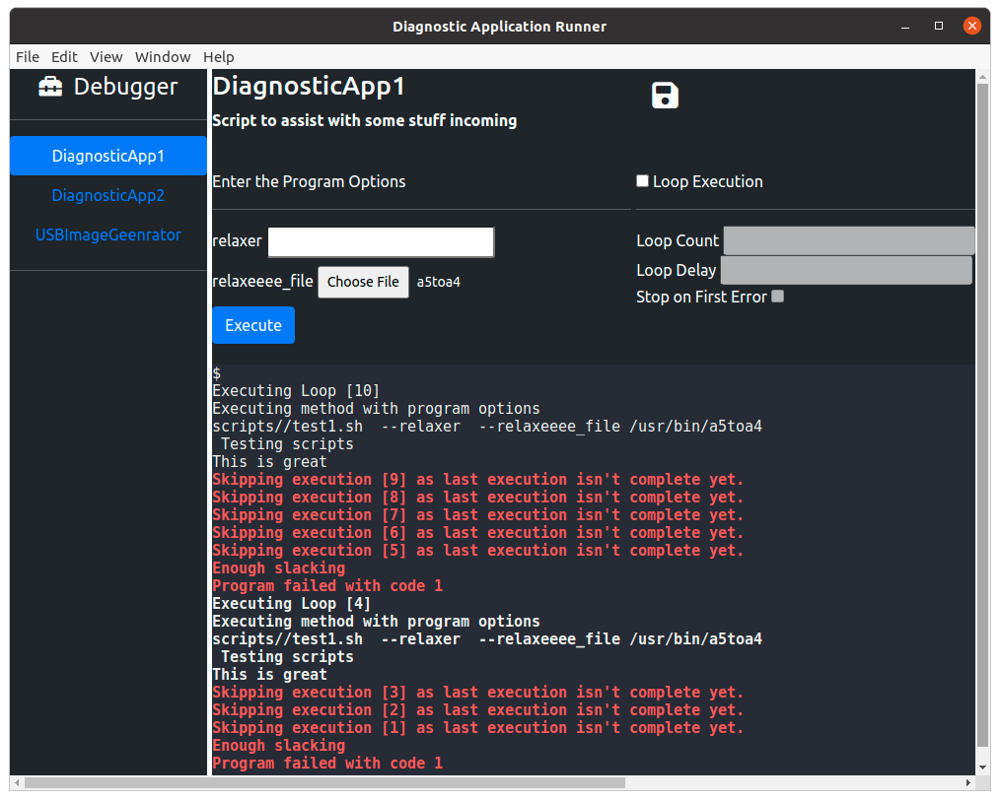
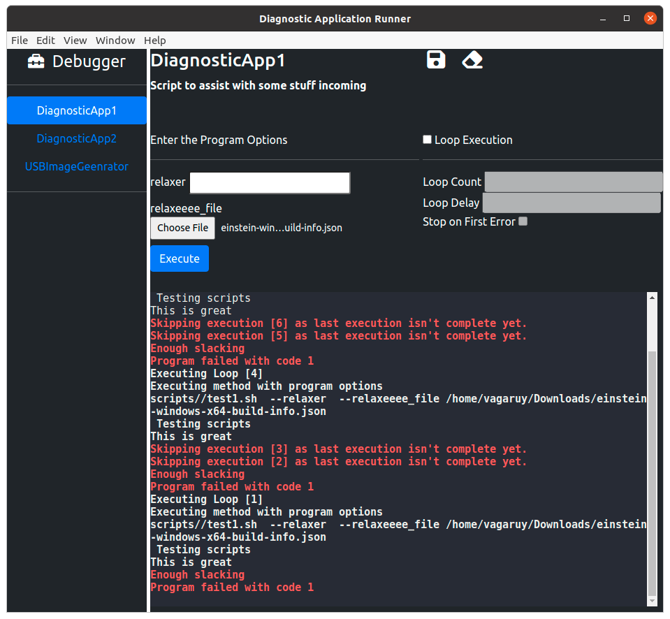
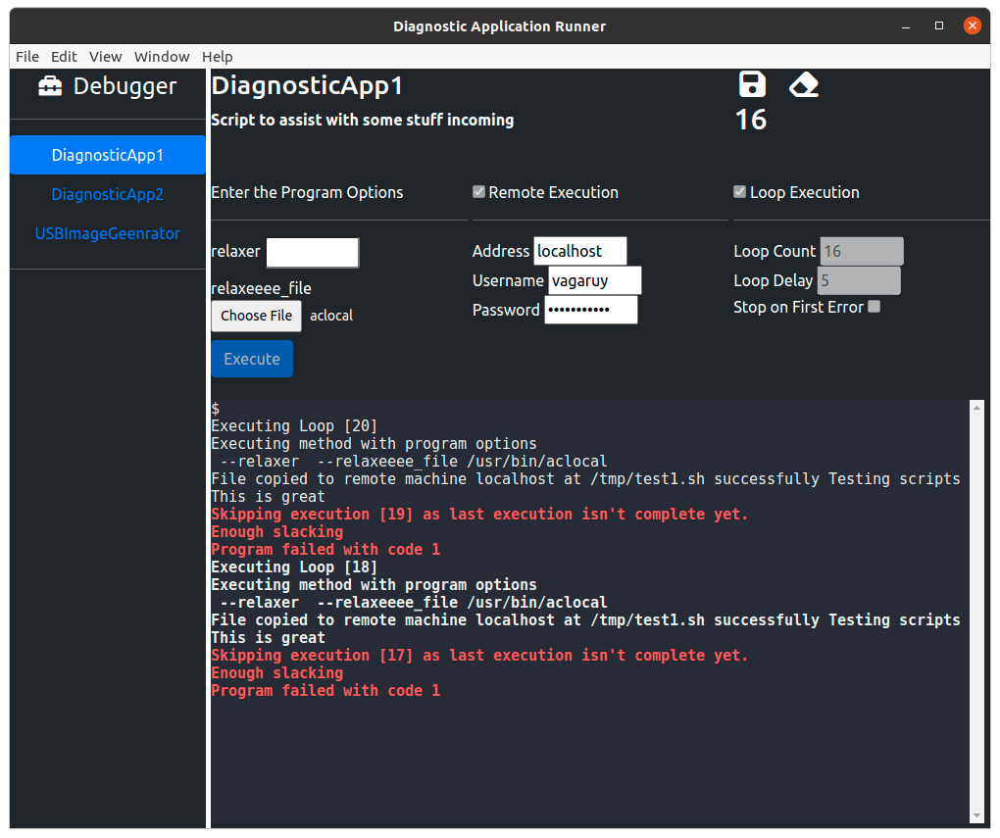

## Introduction

The key to success with any big project is the arsenal of diagnostic applications around them. A lot of these applications are primarly just scripts and command line applications which might make it difficult for novices and non-software folks to use them .

Generating UI is traditionally very labor intensive and might deter users from creating them . Here are a few desired traits:

* Cross platform support
* Auto updater
* Windows Installer / package distribution support for linux
* Hooks for calling C++ functions
* Ease of script calling and output display

## Documentation 

This section contains links to various documentation for quick finding 

[Nodejs Documentation](https://nodejs.org/api/)

XtermJS Documentation

[ElectronJS Documentation](https://www.electronjs.org/docs/latest/)

## Design

#### **High Level Dependency Graph**

```mindmap
- App
  - Backend
 	- Electron
	- EJS
	- SSH2
  - FrontEnd
	- Xtern-Js
	- Bootstrap
	- Jquery
	- Fontawesome
	- FileSaver
```

#### **User** **Interface** 



Keeping the User Interface modern and clean prevents distractions and helps keep the look clean and feel. 

The following UI properties are desired. 

* Dark Mode support
* A pan to select from various scripts on the left sorted in a tree
* A right pan with various options for input / output for working with the script
* A bottom right pan for displaying the output related to script execution

#### **Configuration** **File**

A configuration file can be used to auto generate UI for each script type given that a lot of them perform similar kind of actions.

* Specify program options for the script execution
* Display output in terminal
* Use the return code to prompt success or failure
* Can be executed on a remote target 

  * Specify IP address
  * Specify credentials
* Can be executed in a loop

  * The number of times to execute the script
  * The delay between each execution
  * Whether to stop execution on first fail
* Ability to save the output with a click of the button

Future iterations can likely also bring in the following features that might be desired 

* Ability to execute tasks in parallel
* Single global timer to coordinate loop execution activity across multiple scripts
* Global log report containing output of all executions

Based on the configuraiton options, the following JSON configuration file format was created to support the automatic UI element generation

* Ability to execute multiple scripts in parallel
* Capture global output in a log file from all script executions
* Manage a single timer for multiple loop executions that can trigger scripts in parallel
* Non blocking UI when the scripts are being executed

The following json format is defined for the configuration file based on the needs defined above 

```json
{
  // since this allows execution of C++ code via the shared objects loading, the following parameter could either be shel
  // a c++ function name or a script to be executed 
  "script_name": "test_script", //mandatory option 
  "script_path" : "scripts/test_script.sh",
  "script_summary" : "This script does things ", //mandatory_option
  // valid options - shell/ c++ 
  "script_type": "shell", 
  "script_options": [
    {
          "option_name" : "option1",
          "option_type": "string",
          "option_value": "test_option1"
      },
      {
          "option_name" : "option2",
          "option_type": "file_input"
      }
  ],
  "remote_execution_support": false, //default is true 
  "loop_execution_support": false // default is true 
},
{
  // Options for different scripts specified here 
}
```

#### Front End Framework 

Given the ubiquity of Javascript and the numerous frameworks and supporting libraries around it, it seemed like an obvious choice for this project. [ElectronJs](https://www.electronjs.org/) was chosen for this project due to support for

* Native installer and packaging available for various platforms
* Built in auto update feature
* Based on nodeJs which has robust library support for performing various tasks
* Numerous examples  available online to adopt for the diagnostic framework
* **TODO - Check if support for remote mode exists ? eg. How SiYuan note taking application does it**


#### C++ Shared Object Loading 


#### Packaging 


#### Updates 


#### Sequencing Execution

It would be great to extend the application to also sequence the scripts so complex scripts can be created which can execute many tasks in parallel. The requirements are :

* A UI element that allows to define the sequencing elements dynamically . Add a + button to allow new script selection and then add parameters just like the main window
* Ability to execute scripts sequentially
* Ability to execute scripts in parallel
* Ability to loop through the sequence
* TODO - Whether to record output in one terminal or the normal terminal defines this
* Ability to save this sequence to a file for future
* Load sequence from files 

  ```json
  [
  {
  "sequence_name" : "Reliability testing of the robot" ,
  "sequence_summary" : "The sequence would test the restart level testing of the robot" ,
  "sequence_main" : 
  [
  {
  	"sequence_id" : 1, // when is this sequence activated (multiple parallel scripts can have the same sequence 
  	"script_name" : "AppDiagnostic1",
  	"script_options" : [
      		{
  		          "option_name" : "option1",
  		          "option_type": "string",
  		          "option_value": "test_option1"
  		      },
  		      {
  		          "option_name" : "option2",
  		          "option_type": "file_input",
  			  "option_value" : "test_option2"
  		      }
  		  ]
  }
  ]

  },
  {
  	// more task sequences go here 
  }

  ]
  ]
  }


  ]
  ```

* Disable normal script execution when sequence execution is in progress to prevent any conflicts

## Problems

* Layout is terribly difficult. It's non-trivial to get the elements to appear in the exact desired space even for a simple layout like the application requires. 

  * Flexbox turned out fairly annoying to get right
  * CSS Grid turned out to be a better solution for the grid for this one page application.


## Implementation

* [X] Build the wireframe design with three panes as described in wireframe 

  

  Used `xterm` and `xterm-addon-fit` for the Terminal to show the output, bootstrap for the navigation tab and EJS for the template engine to render the UI from the JSON dynamically.
* [X] Add support for saving and restoring window location on restarts 

  Used `electron-window-state` for this
* [X] Add json parsing
* [X] Populate the left pane with the script names
* [X] Add support for opening a window in the right pane when a script name is clicked
* [X] Populate the program options on the right pane based on the json file 

  

  Using a combination of Embedded Java script and DOM manipulation with Jquery, we can generate a dynamic options form that the user populates and then on Execute - the message is sent to the back end via Electron IPC mechanism for actual execution 

  On a different channel, the backend will send message to front end with updates on logs from the execution,when the execution is started, completed , return code on finish so the front end can render the UI appropriately.
* [X] Create a communicate channel for communication between front end and backend
* [X] Send the scriptname and program options to the backend for execution
* [X] Populate options regarding loop  and related options 

  
* [X] Add a terminal window to display the output for each script execution
* [X] Add option to save the output to a file

  
* [X] ~~Add a pane showing the pass/fail status~~
* [X] Reset terminal 

  
* [X] Add support for script execution via ssh and capture the output 

  
* [ ] Add pane for global configuration options in menu

  * [ ] Max script execution time policy
  * [ ] Button to save all script output in one file
* [X] Pipe the captured output on the screen
* [X] Add ability to execute in loop with the number of values specified
* [X] ~~Add support for simultaneous execution based on a global timer~~
* [ ] Pass program option to run in daemon mode and be used remotely in a terminal .
* [ ] ~~On each script execution completion, trigger a desktop notification from backend to alert the user.~~


## Usage Instructions

1. Clone the repository and initialize the node modules 

    ```json
    git clone git@github.com:vagaruy/debugger-interface.git
    cd debugger-interface 
    #yarn can be installed using npm -i -g yarn 
    yarn install
    yarn run start
    ```
2. Package the application for linux distributions 

    ```json
    #Install electron-builder if not present 
    #yarn -i electron-builder --global 
    electron-builder -l
    #Run using command below 
    ./dist/*.AppImage
    ```
